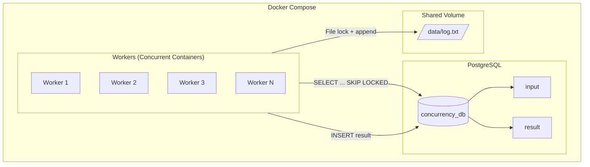

# Concurrencia con Contenedores

Proyecto académico enfocado en el diseño e implementación de un sistema concurrente utilizando múltiples contenedores Docker. Cada contenedor (worker) procesa datos de manera independiente mientras comparte recursos como una base de datos y un sistema de archivos.

---

## Objetivo

Evaluar la comprensión de los siguientes conceptos:

- Concurrencia
- Exclusión mutua
- Sincronización
- Condiciones de carrera
- Consistencia de datos

Mediante la ejecución simultánea de múltiples contenedores que acceden a recursos compartidos.

---

## Arquitectura del sistema

El sistema está compuesto por:

- PostgreSQL como base de datos central compartida
- N contenedores worker que procesan tareas concurrentemente
- Un volumen compartido para escritura en archivo (`/data/log.txt`)



### Descripción

Cada worker:
1. Lee un conjunto de datos desde la base de datos
2. Procesa la información de forma independiente
3. Escribe el resultado en una tabla compartida
4. Registra actividad en un archivo común

---

## Tecnologías utilizadas

- Java 21
- Spring Boot
- PostgreSQL 15
- Docker y Docker Compose
- JPA / Hibernate

---

## Ejecución del proyecto

### Levantar el sistema

```bash
sudo docker compose up --build --scale worker=7
```
Este comando:

* Construye la imagen del worker
* Inicia el contenedor de PostgreSQL
* Levanta múltiples workers en ejecución concurrente

---

### Detener y limpiar el entorno

```bash
sudo docker compose down -v
```

Este comando:

* Detiene todos los contenedores
* Elimina la red creada por Docker Compose
* Elimina los volúmenes (incluyendo los datos persistidos)

--- 

## Base de datos 

### Tabla input 

```postgresql
CREATE TABLE input (
    id SERIAL PRIMARY KEY,
    description TEXT NOT NULL,
    status VARCHAR(20) DEFAULT 'pending'
);
```

### Tabla result 

```postgresql
CREATE TABLE result (
    id SERIAL PRIMARY KEY,
    input_id INT REFERENCES input(id),
    worker_identifier VARCHAR(50) NOT NULL,
    result TEXT NOT NULL,
    date TIMESTAMP DEFAULT CURRENT_TIMESTAMP
);
```

---

## Procesamiento concurrente 

Cada worker ejecuta el siguiente flujo:

1. Consulta registros con estado pending
2. Bloquea filas para evitar acceso concurrente
3. Procesa los datos
4. Inserta resultados en la tabla result
5. Actualiza el estado del registro
6. Escribe en el archivo compartido

---

## Control de concurrencia 

### En la base de datos

Se utiliza la siguiente consulta: 

```postgresql
SELECT *
FROM input
WHERE status = 'pending'
ORDER BY id
LIMIT 1
FOR UPDATE SKIP LOCKED;
```

Esto permite:

* Evitar que múltiples workers procesen el mismo registro
* Implementar exclusión mutua a nivel de fila
* Mantener alta concurrencia sin bloqueos globales

---

### En el sistema de archivos

Se implementa bloqueo de escritura mediante 

```java
FileChannel.lock()
```
Esto garantiza:

* Escritura exclusiva en el archivo compartido
* Prevención de corrupción de datos
* Operaciones de escritura atómicas

--- 

## Evidencias de ejecución 

Contenedores en ejecución
```bash
sudo docker ps
```

Logs concurrentes 

```bash
sudo docker compose logs -f
```

Resultados en la base de datos 

```postgresql
SELECT * FROM result ORDER BY date;
```

Distribución del trabajo

```postgresql
SELECT worker_identifier, COUNT(*)
FROM result
GROUP BY worker_identifier;
``` 

Archivo compartido
```bash
docker exec -it <worker> tail -f /data/log.txt
```

---

## Dificultades encontradas

### Problemas de conexión a la base de datos

* Error: UnknownHostException: postgres
* Causa: configuración incorrecta de red en Docker

### Inicialización fallida de la base de datos

* Error en init.sql
* Causa: falta de punto y coma antes de una sentencia INSERT

### Saturación del sistema

* Uso de muchos workers junto con gran volumen de datos
* Solución:
  * Reducir número de workers
  * Reducir volumen de registros

### Identificación de contenedores
* HOSTNAME no coincide con nombres tipo worker-1
* Docker asigna identificadores internos

### Terminación de contenedores

* Los workers finalizaban al no encontrar tareas
* Se implementó un loop continuo para mantener ejecución

## Resultados obtenidos

* Procesamiento concurrente correcto
* Distribución de carga entre múltiples workers
* No se presentaron duplicaciones de datos
* Consistencia garantizada por la base de datos
* Escritura concurrente controlada en archivo compartido

--- 

## Manejo de concurrencia 

### Autoincremental 

Se delega completamente a PostgreSQL mediante 

```postgresql
SERIAL PRIMARY KEY
```
Esto evita condiciones de carrera en la generación de identificadores.

### Locks en base de datos

Se implementan mediante:

* FOR UPDATE
* SKIP LOCKED

Permitiendo exclusión mutua y alta concurrencia.

### Escrituras atómicas

Se aplican en:

* Inserciones SQL dentro de transacciones
* Escritura en archivo mediante append y locks 

--- 

## Conclusiones

El sistema implementa correctamente:

* Concurrencia real mediante múltiples contenedores
* Exclusión mutua a nivel de base de datos y sistema de archivos
* Coordinación eficiente entre procesos independientes
* Uso seguro de recursos compartidos

Se logró evitar:

* Condiciones de carrera
* Duplicación de registros
* Inconsistencias en los datos
* Corrupción en el archivo compartido

## Estructura del proyecto 

```bash
.
├── docker-compose.yml
├── init.sql
├── Dockerfile
├── src/
│   └── main/java/...
└── README.md
```

---

## D